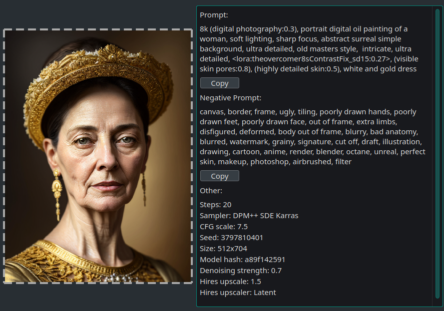

# sd-prompt-inspector
PyQt program to extract prompt metadata from SD-generated images

Drag an image generated with auto1111 or with ComfyUI (using WLSH Nodes 'save with file data' node for now).

Screenshot

